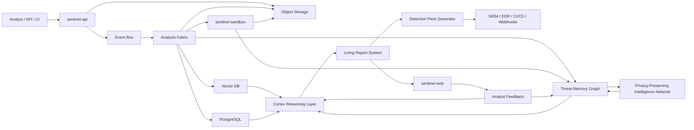

# SENTINEL Future Architecture Specification

> Classification: Internal - Future Platform Architecture
> Status: Build-ready strategic specification
> Audience: Engineering, security research, product leadership
> Version: 1.0
> Date: May 2026

## 1. Founder-Level Technical Thesis

SENTINEL is not a file scanner. It is an intelligence operating system for malicious artifacts.

The current platform can ingest a file, extract static indicators, build a behavior profile, and show an analyst-facing report. The future platform turns that foundation into a living intelligence fabric: every sample becomes a node in a continuously learning graph of behaviors, tools, infrastructure, campaigns, detections, and analyst decisions.

The product moat is not "AI summary generation." That will become cheap. The moat is the compound system around it:

- Behavior memory that recognizes recurring attacker intent across files and tenants.
- Evidence-first reasoning that links every conclusion back to observable facts.
- Analyst feedback that improves scoring, clustering, detection generation, and triage.
- Automated detection and response artifacts that are validated before being trusted.
- Privacy-preserving collective intelligence that learns from the network without exposing customer files.

The platform should feel less like uploading a file to a website and more like handing evidence to an elite malware research team that remembers every investigation it has ever performed.

## 2. North-Star Architecture

SENTINEL is event-driven, graph-native, AI-assisted, and evidence-first.

- **Event-driven**: every upload, analysis stage, graph update, AI conclusion, detection export, and analyst action emits a structured event.
- **Graph-native**: files, behaviors, IOCs, rules, campaigns, tenants, and analyst judgments are first-class connected entities.
- **AI-assisted**: Cortex proposes hypotheses, narratives, detections, and playbooks, but never overrides evidence provenance.
- **Evidence-first**: reports are explainable because every risk statement points to the strings, PE features, sandbox events, rules, or related samples that justify it.



### Trust Boundaries

- Uploaded files are untrusted from first byte through final artifact retention.
- Sandbox execution is isolated from the control plane and has no direct access to production databases.
- AI outputs are advisory until linked to evidence and persisted with confidence, provenance, and model metadata.
- Tenant data is isolated by authorization, storage paths, encryption boundaries, and query scoping.
- Shared intelligence uses derived features, embeddings, and behavioral fingerprints, never raw customer samples unless explicitly opted in.

## 3. Core Services

### `sentinel-api`

Public REST API, authentication boundary, upload orchestration, and report access.

Responsibilities:

- Accept uploads, compute hashes, enforce file limits, and create analysis jobs.
- Store raw samples in object storage and emit `analysis.job.created`.
- Serve reports, job status, detection packs, feedback endpoints, and webhook configuration.
- Enforce tenant isolation, API keys, rate limits, audit logging, and authorization.

Current bridge:

- Evolves from the existing FastAPI routes and SQLAlchemy models.
- Keeps the current REST-first shape while adding richer report, graph, and feedback endpoints.

### `sentinel-analysis-worker`

Static intelligence engine for executable and document artifacts.

Responsibilities:

- Parse PE, ELF, Mach-O, scripts, archives, Office documents, PDFs, and containers.
- Extract ASCII, UTF-16, and format-native strings with offset, encoding, classification, and confidence.
- Produce behavior profiles from imports, strings, sections, permissions, metadata, and known tool patterns.
- Run YARA and Sigma-compatible static detections.
- Emit `analysis.static.completed` with evidence references.

Current bridge:

- Evolves from `backend/app/worker.py`.
- The current behavior profile becomes the first version of the canonical `BehaviorProfile` entity.

### `sentinel-sandbox`

Isolated execution and behavioral event capture.

Responsibilities:

- Detonate eligible samples in disposable Windows and Linux sandboxes.
- Capture process trees, registry activity, file writes, mutexes, network traffic, DNS, HTTP, TLS metadata, screenshots, and memory indicators.
- Detect sandbox evasion, delayed execution, process injection, persistence, credential access, and C2 patterns.
- Emit `analysis.dynamic.completed` with normalized behavior events.

Security rule:

- Sandbox workers never receive direct database credentials. They write artifacts to object storage and publish signed event payloads through the event bus.

### `sentinel-cortex`

Reasoning layer for narratives, hypotheses, analyst Q&A, and response guidance.

Responsibilities:

- Transform static, dynamic, graph, and similarity evidence into structured conclusions.
- Generate executive summaries, analyst narratives, MITRE mappings, confidence scores, and recommended actions.
- Support analyst questions such as "why is this malicious?", "what changed from the last sample?", and "what detection should I deploy?"
- Maintain model metadata, prompt version, evidence references, and confidence calibration.

Hard requirement:

- Cortex cannot persist a conclusion without evidence links. A claim without provenance is treated as draft text, not intelligence.

### `sentinel-graph`

Threat memory graph, similarity service, family lineage engine, and campaign clustering layer.

Responsibilities:

- Store relationships between files, behavior profiles, strings, imports, sections, IOCs, detections, tenants, campaigns, and analyst decisions.
- Compute similarity using behavior names, evidence tokens, API/import sets, string embeddings, code embeddings, and sandbox event sequences.
- Cluster related samples into families and campaigns.
- Maintain tenant-specific baselines so the same artifact can be judged differently depending on environment context.

Current bridge:

- Starts by indexing existing `static_data.behavior_profile`, IOCs, and reports.
- Later adds embeddings and graph traversal without breaking current report APIs.

### `sentinel-detection-lab`

Detection pack generator, validator, and export service.

Responsibilities:

- Generate YARA, Sigma, Suricata, EDR queries, SIEM searches, and CI/CD policy rules from report evidence.
- Validate generated rules against the original sample, nearby similar samples, benign corpora, and known false-positive patterns.
- Attach confidence, expected matches, evidence, and rollback notes to every rule.
- Export to Splunk, Elastic, Microsoft Sentinel, Chronicle, GitHub Actions, GitLab CI, and webhooks.

Rule of trust:

- No generated rule is marked production-ready until it passes validation and records what evidence it detects.

### `sentinel-web`

Analyst dashboard, investigation workspace, living reports, behavior replay, and SOC autopilot UI.

Responsibilities:

- Show reports as living objects, not static pages.
- Render behavior graphs, attack-chain timelines, similar samples, generated detections, analyst annotations, and recommended actions.
- Let analysts accept, reject, annotate, and correct Cortex conclusions.
- Provide queue-level triage: clustering, deduplication, priority, ownership, and response status.

Current bridge:

- Evolves from the existing Next.js dashboard and report tabs.
- The Behavior Graph tab becomes the entry point for living reports and threat memory.

## 4. Data Architecture

### Primary Stores

| Store | Purpose | Examples |
|:---|:---|:---|
| PostgreSQL | Transactional system of record | tenants, users, jobs, reports, audit state |
| Object storage | Large unstructured artifacts | samples, extracted files, PCAPs, screenshots, memory dumps |
| Vector database | Similarity search | behavior embeddings, code embeddings, string embeddings |
| Graph database or graph tables | Relationship intelligence | file-to-behavior, behavior-to-campaign, IOC-to-sample |
| ClickHouse or equivalent | High-volume analytics | telemetry, events, trends, queue metrics |
| Redis or queue backend | Dispatch and short-lived state | job queues, locks, rate counters |

### Canonical Entities

- **File**: immutable artifact identity keyed by hashes, size, type, source, and storage reference.
- **AnalysisJob**: one execution of the pipeline for a file under a tenant, analyzer version, and configuration.
- **ThreatReport**: analyst-facing result with verdict, severity, narrative, evidence, static data, dynamic data, and generated detections.
- **BehaviorProfile**: normalized capability map derived from static and dynamic evidence.
- **IOC**: URL, domain, IP, email, registry key, file path, mutex, certificate, wallet, or command indicator.
- **DetectionRule**: generated or curated detection artifact with format, logic, validation status, confidence, and evidence references.
- **CampaignCluster**: group of related files, infrastructure, behaviors, and detections inferred by graph and similarity signals.
- **AnalystFeedback**: structured correction, label, note, verdict override, rule approval, or false-positive report.

### Evidence Model

Every conclusion points to one or more evidence objects:

```json
{
  "claim": "Persistence behavior detected",
  "confidence": 0.91,
  "evidence_refs": [
    {"type": "string", "offset": 9938590, "value": "Software\\Microsoft\\Windows\\CurrentVersion\\Run"},
    {"type": "behavior", "name": "persistence"},
    {"type": "similar_sample", "sha256": "..." }
  ],
  "producer": "sentinel-analysis-worker",
  "analyzer_version": "behavior-v2"
}
```

## 5. Execution Pipeline

Canonical pipeline:

1. Upload receives a file and computes hashes.
2. `sentinel-api` stores the sample and creates an `AnalysisJob`.
3. `analysis.job.created` is emitted.
4. `sentinel-analysis-worker` performs static analysis.
5. Static output becomes strings, IOCs, PE/ELF/Mach-O metadata, YARA matches, and a `BehaviorProfile`.
6. `sentinel-graph` performs similarity lookup and graph expansion.
7. `sentinel-sandbox` runs when file type, risk, tenant policy, and resource budget allow it.
8. Cortex generates evidence-linked narrative, hypotheses, MITRE mappings, response guidance, and severity.
9. Living report is published and updated as later evidence arrives.
10. Detection Lab generates and validates rule packs.
11. Webhooks, SIEM exports, and analyst notifications are delivered.
12. Analyst feedback loops back into Cortex, graph scoring, and detection validation.

### Event Names

- `analysis.job.created`
- `analysis.static.started`
- `analysis.static.completed`
- `analysis.dynamic.started`
- `analysis.dynamic.completed`
- `graph.similarity.completed`
- `cortex.reasoning.completed`
- `report.published`
- `report.updated`
- `detection.pack.generated`
- `detection.pack.validated`
- `feedback.submitted`
- `webhook.delivery.failed`

### Failure Behavior

- Static analysis failure marks the job failed unless the file is unsupported, in which case the report is completed with an unsupported-format note.
- Sandbox failure degrades gracefully and keeps static plus Cortex output.
- Cortex failure completes the report with `ai_available=false` and queues retry.
- Detection generation failure never blocks report publication.
- Every failed stage emits an event with error class, message, retryability, and correlation ID.

## 6. Public Interfaces

SENTINEL remains REST-first. GraphQL can be added later for complex investigation views, but the platform should not require it for core workflows.

### Core Existing APIs

- `POST /api/v1/analyze`
- `GET /api/v1/analyze/{job_id}`
- `GET /api/v1/jobs`
- `GET /api/v1/report/{hash}`

### Future APIs

#### Refresh a Living Report

`POST /api/v1/report/{hash}/refresh`

Purpose: re-run graph expansion, Cortex reasoning, and detection generation against the latest analyzer versions and threat memory.

Response shape:

```json
{
  "job_id": "uuid",
  "status": "QUEUED",
  "message": "Report refresh queued."
}
```

#### Behavior Similarity Lookup

`GET /api/v1/report/{hash}/similar`

Purpose: return related files, shared behaviors, shared IOCs, family clusters, and confidence.

Response shape:

```json
{
  "hash": "sha256",
  "matches": [
    {
      "file_hash_sha256": "sha256",
      "similarity_score": 87,
      "shared_behaviors": ["persistence", "credential_access"],
      "shared_iocs": ["example.com"],
      "cluster_id": "uuid"
    }
  ]
}
```

#### Detection Pack Generation

`POST /api/v1/report/{hash}/detections`

Purpose: generate detection artifacts for selected targets.

Request shape:

```json
{
  "targets": ["yara", "sigma", "suricata", "splunk"],
  "strictness": "balanced"
}
```

#### Analyst Feedback

`POST /api/v1/report/{hash}/feedback`

Purpose: collect verdict corrections, evidence notes, false positives, false negatives, and rule approvals.

Request shape:

```json
{
  "type": "verdict_correction",
  "value": "SUSPICIOUS",
  "comment": "Admin tool, but risky in this tenant environment."
}
```

#### Graph Relationship Query

`GET /api/v1/graph/relationships`

Purpose: support investigation views for files, IOCs, campaigns, behaviors, and detections.

Required query parameters:

- `entity_type`
- `entity_id`
- `depth`

#### Webhook Delivery

`POST /api/v1/webhooks`

Purpose: configure tenant webhooks for report completion, malicious verdicts, detection generation, and failed deliveries.

## 7. Reliability, Security, and Trust

### Reliability Principles

- Jobs are idempotent by file hash, tenant, analyzer version, and analysis configuration.
- Every stage can be retried independently.
- Report publication is incremental: static results appear before dynamic results when needed.
- Queue depth, p95 stage duration, error rate, and stuck jobs are first-class metrics.
- Analyzer versioning is mandatory so stale cached reports never hide improved analysis.

### Security Principles

- Samples are encrypted at rest and segregated by tenant storage prefix.
- Sandbox execution runs in disposable, network-controlled environments.
- Object storage access is short-lived and scoped.
- Internal service calls use signed service identity.
- Generated detections and response actions require explicit policy gates before deployment.
- All analyst and automation actions are audit logged.

### AI Trust Principles

- AI output must include evidence references.
- AI confidence must be calibrated against stage-level evidence quality.
- AI-generated detection rules must be validated before export.
- Analyst corrections are stored as structured feedback, not only comments.
- Model and prompt versions are stored on every Cortex output.

## 8. Build Phases

### Phase 1: Intelligence Upgrade

Goal: make the current product feel materially smarter without adding new infrastructure.

Deliverables:

- Higher quality string extraction, IOC normalization, and PE metadata.
- Behavior profile v2 with evidence references.
- Report UI tabs for behavior, strings, IOCs, and cross-reference matches.
- Analyzer versioning and report refresh.

Success criteria:

- Known samples show meaningful strings and behaviors.
- Re-analysis does not return stale old reports.
- Analysts can explain verdicts from evidence without reading raw JSON.

### Phase 2: Threat Memory

Goal: turn completed analyses into reusable intelligence.

Deliverables:

- Similarity indexing for behavior profiles, IOCs, imports, and string tokens.
- Graph relationships between reports, behaviors, IOCs, and generated rules.
- Campaign clustering MVP.
- Tenant-specific baselines for common admin tools and internal software.

Success criteria:

- New reports show similar samples and shared evidence.
- Repeated tools are clustered automatically.
- Analysts can distinguish "globally suspicious" from "normal for this tenant."

### Phase 3: Cortex Workspace

Goal: shift from passive reports to interactive investigation.

Deliverables:

- Evidence-linked Cortex narratives.
- Analyst Q&A over a report and its graph neighborhood.
- Attack-chain reconstruction timeline.
- Living report refresh when new related samples or feedback appear.

Success criteria:

- Cortex can answer "why" questions with evidence.
- Reports update when similarity or analyst feedback changes.
- Analysts can accept, reject, or correct conclusions in the UI.

### Phase 4: Detection Automation

Goal: make every high-confidence report actionable.

Deliverables:

- Detection pack generation for YARA, Sigma, Suricata, Splunk, Elastic, and Microsoft Sentinel.
- Rule validation against sample, similar samples, and benign corpora.
- Export history and approval workflow.
- CI/CD security policy output for build artifacts.

Success criteria:

- Detections include evidence, confidence, and validation results.
- False-positive risk is visible before export.
- Approved rules can be pushed into downstream tools.

### Phase 5: Autonomous SOC Layer

Goal: reduce analyst workload at the queue level, not only the report level.

Deliverables:

- SOC autopilot queue with deduplication, clustering, prioritization, and ownership.
- Response playbook drafts with rollback guidance.
- Privacy-preserving intelligence network for shared behavior fingerprints.
- Executive and operational views over threat trends and response progress.

Success criteria:

- Related alerts collapse into investigation groups.
- High-risk samples are prioritized automatically.
- Shared intelligence improves local detection without raw sample exposure.

## 9. Engineering Defaults

- Monolith-first is acceptable for early phases, but service boundaries must be explicit in code and data contracts.
- Prefer PostgreSQL JSON columns for early iteration, then promote stable structures into typed tables.
- Prefer REST APIs until graph queries become too expressive for REST.
- Prefer evidence-preserving heuristics before opaque model conclusions.
- Prefer local development without cloud dependencies, with optional production-grade backends behind configuration.
- Never build automated response that cannot be audited, explained, and rolled back.

## 10. Immediate Backlog Seeds

These stories can be created directly from this specification:

1. Add report refresh endpoint keyed by analyzer version.
2. Promote behavior profile evidence references into a stable schema.
3. Add searchable strings tab with classification filters.
4. Add similarity index table for behavior profiles and IOCs.
5. Add graph relationship API for file-to-behavior and file-to-IOC links.
6. Add Cortex prompt contract requiring evidence references.
7. Add detection pack generator MVP for YARA and Sigma.
8. Add analyst feedback endpoint and report UI controls.
9. Add stuck-job monitoring and retry endpoint.
10. Add audit log table for analyst and automation actions.

## 11. Definition of Done for Future Architecture Work

A feature belongs in this architecture only when it satisfies all of the following:

- It produces, consumes, or improves structured evidence.
- It improves analyst understanding, response speed, or detection quality.
- It records enough provenance to be audited.
- It works for one tenant without leaking data to another.
- It can degrade gracefully when AI, sandbox, graph, or detection services are unavailable.

SENTINEL wins by becoming the place where malicious artifacts stop being mysterious. The platform should convert every file into memory, every memory into better judgment, and every judgment into action.
